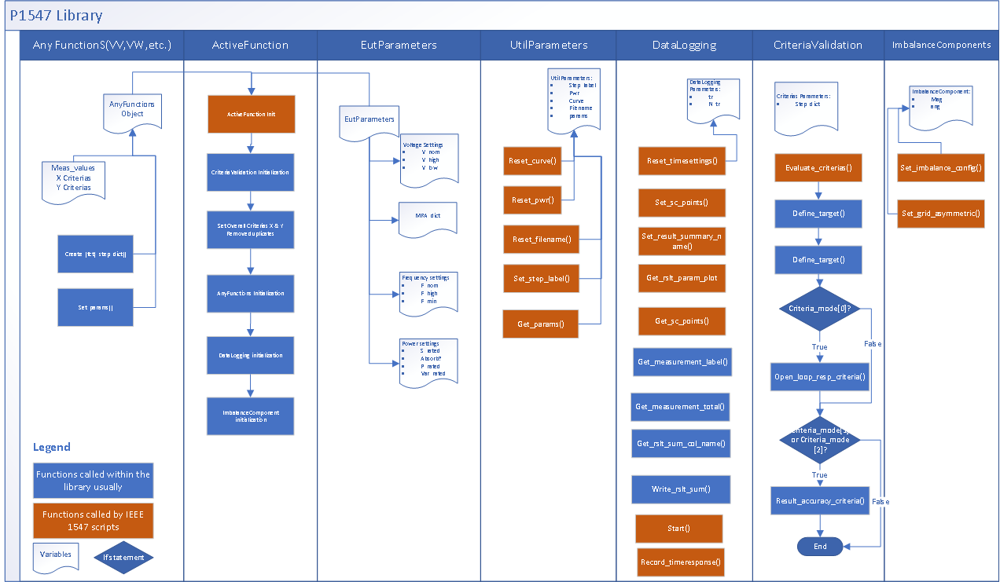
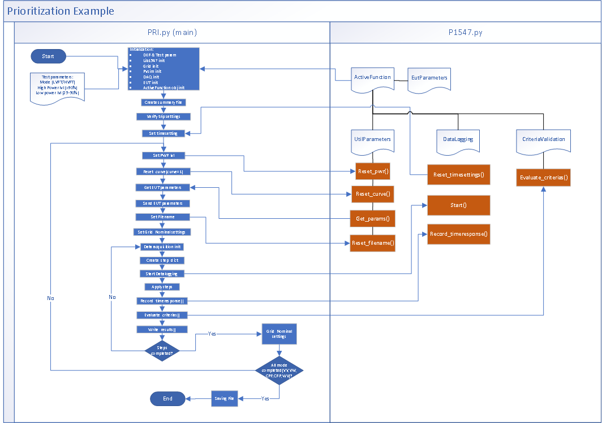

## P1547.1 Compliance Python Test Scripts

---

This repository contains all of the open-source OpenSVP components written in Python 3.7. 
Hence, Python 3.7+ is required.

## Contribution

For the contribution list, please refer to [Contribution section](/1547.1/doc/CONTRIB.md)

### Installation

Please refer to the [Install section](/1547.1/doc/INSTALL.md) for detailed instruction

### SVP Scripts

Current compliance test scripts available:

#### Limit Active Power
   Limit Active Power (LAP):
   - [x] Limit active power mode 

#### Voltage regulation
   Constant power factor (CPF):
   - [x] Constant power factor mode 

   Volt-reactive power (VV):
   - [x] Volt-var mode
   - [ ] Volt-var mode(Vref Test)
   - [x] Volt-var mode with an imbalanced grid

   Active power-reactive power (VW):
   - [x] Active power-reactive mode
   - [x] Active power-reactive mode with an imbalanced grid
   - [x] Active power-reactive power (WV)
   
   Constant reactive power (CRP):
   - [x] Constant reactive power mode 

#### Frequency support
- [x] Frequency-watt or Frequency-droop - above nominal frequency (FW)
- [x] Frequency-watt or Frequency-droop - below nominal frequency (FW)

#### Ride-Through support
- [X] Phase-Change Ride-Through
- [X] High/Low Frequency Ride-Through (Ongoing)
- [X] Voltage Ride-Through

#### Prioritization of DER responses
- [x] Test for voltage and frequency regulation priority (PRI)

#### Limitation of overvoltage contribution
- [ ] Ground fault overvoltage (GFOV) test
- [ ] Load rejection overvoltage (LROV) test

#### Varia
- [ ] Interoperability test

#### Unitentional Islanding
- [ ] Unitentional islanding test

Note: The Unintentional Islanding PHIL model was created through the CIESESE program at Sandia National Laboratories. 
A multi-year collaboration between the University of Puerto Rico Mayaguez and Sandia National Laboratories produced the 
UI Opal-RT RT-LAB model that combines hardware and software tools (OPAL + MATLAB/Simulink + LabView + SVP) to emulate an 
RLC load bank with full visualization of values with easy adjustment of the resonance condition necessary for island 
experiments. 

Preliminary results are presented in the following papers and will be discussed 
in detail in the Ph.D. dissertation of Edgardo Desardén Carrero, expected in May 2021.

* S. Gonzalez, E. Desarden, N. S. Gurule, and E. E. A. Bezares, “Unintentional Islanding Evaluation Utilizing Discrete RLC Circuit Versus Power Hardware-in-the Loop Method,” 46th IEEE Photovolt. Spec. Conf., 2019. 
* E. Desarden-Carrero, R. Darbali-Zamora, N. S. Gurule, E. Aponte-Bezares and S. Gonzalez, “Evaluation of the IEEE Std 1547.1-2020 Unintentional Islanding Test Using Power Hardware-in-the-Loop” 47th IEEE Photovolt. Spec. Conf., 2020. 

### P1547 Library

#### Functions Classes

P1547 Library now has one main class named ActiveFunction and it inherit all the slow advanced inverter function (AIF) class needed (Volt-Var, Volt-Watt, Frequency-Watt, Constant Reactive Power, Constant Power Factor, Watt-Var, Limit Active and Prioritization).

Each of the function has a class consisting of the following parameters:

meas_values: Include all necessary measured values to be recorded.

The following terminology used has been taken from IEEE 1547.1 Annex C.

x_criterias: The X parameter(s) are all values that will be used to create a disturbance during the test. Most common type of values are voltage, frequency, power and power factor.

y_criterias: The Y parameter(s) are all the observed values post-disturbance. These values are usually evaluated following the method shown in IEEE 1547.1 Annex C. From these values, we can have lower and upper target and see if the EUT does pass/fail at each disturbance steps within the test. 

#### Additional Classes

Any steps dictionary and parameters settings will be created through its respective class.
Additional Classes have been created to create a better distinction of their tasks:

EutParameters: Class representing taking

DataLogging: Class taking care of all tasks related to data acquisition and measuring data.

CriteriasValidation: Class taking care of defining all the targets necessary either for steps value or the evaluated criteria for pass-fail. Next, it verifies the measured value are within the evaluated targets to validate if the EUT complies.

UtilParameters: Class that contains useful functions but does not fit with any of the other classes. As an example, most functions related to plot creation and column name are included in this class.

HilModel: Class containing all HIL aspect related function for mostly fast functions for now.

#### Active Function Class

The proposed workflow is to use the library with the ActiveFunction class. From that class, it will initialize all the needed function depending on the script and merge all the meas_values, x_criterias and y_criterias from all the function while removing duplicates. 
ActiveFunction = p1547.ActiveFunction(ts=ts,
                                      functions=[PRI, VW, FW, VV, CPF, CRP, WV],
                                      script_name='Prioritization',
                                      criteria_mode=[False, False, True])

#### Example of P1547 usage with a 1547 script library

To be completed...

### Support

For any bugs/issues, please refer to the [bug tracker][bug-tracker-url] section.

🐙 was here.

[bug-tracker-url]: https://github.com/BuiMCanmet/svp_1547.1/issues
[1547-1-url]: https://github.com/BuiMCanmet/svp_1547.1/tree/master_python37

